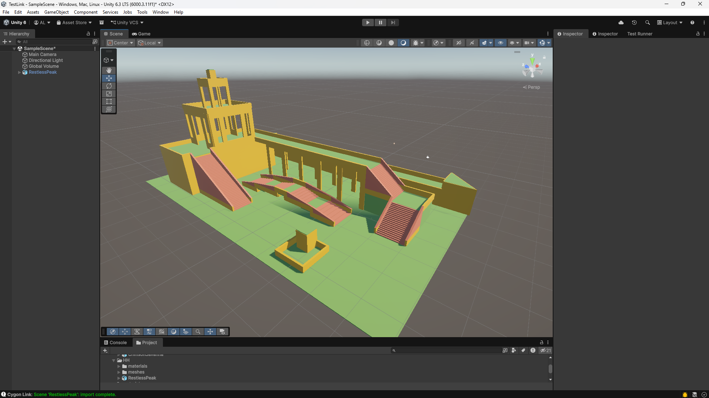

# Your First Import
This guide walks you through importing a scene made in Cygon into Unity for the first time.

## Step 1 — Export from Cygon
- In Cygon's Project Manager, set the export path to a folder **inside your Unity project's `Assets/` folder**.
- Use **CTRL + S** or the export button.
- Cygon generates a `.usda` file along with a `meshes/` subfolder (individual mesh files) and a `textures/` folder.


**Example structure inside your `Assets/` folder (MyScene = the name of your Cygon scene):**
```
Assets/
└── MyScene/
    ├── MyScene.usda
    ├── meshes/
    │     ├── Wall.usda
    │     ├── Stairs.usda
    │     └── Floor.usda
    ├── textures/
    │     └── ...
    └── materials/        ← generated automatically by Cygon Link
          └── ...
```

> Exporting (or copying) the files **inside `Assets/`** is required, the importer only processes `.usda` files under `Assets/`, and it resolves mesh/texture paths relative to the `.usda` location.

## Step 1 bis — Alternative: Drag & Drop
If you already have the exported files on disk, drag the `.usda` file **together with its `meshes/` and `textures/` folders** from your OS file explorer into the Unity **Project window**.

> **Keep the relative layout** (`meshes/` and `textures/` next to the `.usda`). For [Live Sync](LiveSync.md) to work, the files must live under `Assets/`.

## Step 2 — Automatic Import
- Cygon Link recognizes Cygon `.usda` files by their header and imports them automatically through its Scripted Importer — no pop-up, no manual approval.
- It builds the mesh(es) with a `MeshCollider`, reconstructs the scene hierarchy, and generates materials in a sibling `materials/` folder (one submesh + material per USD `GeomSubset` for multi-material meshes).
- On the **very first** import you may see the scene reimport once so the freshly-created materials bind — this is expected.

## Step 3 — Add to Scene
Drag the imported `.usda` asset from the **Project window** into your **Hierarchy** or **Scene view**, and start using what you built in Cygon.

## Testing Without Cygon
A sample scene is included under `Docs/Samples/`. Drag it into the Project window to verify that:
- Cygon Link correctly intercepts the file,
- meshes, hierarchy and materials are generated,
- no errors appear in the Console.

It should look like this in your viewport after importing and dragging it into the level:

